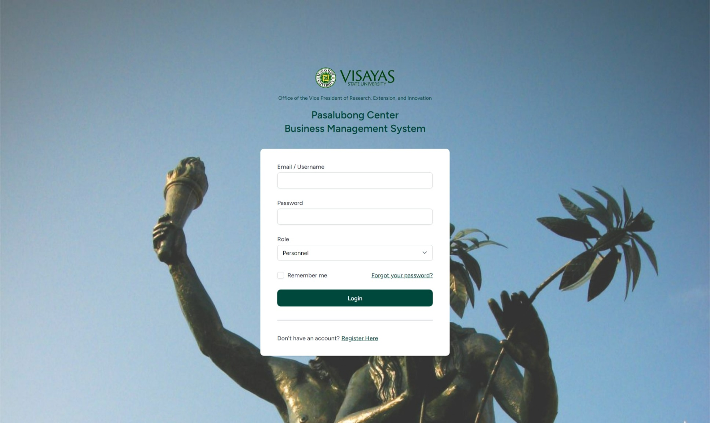

# Laravel Breeze Inertia Vue - Business Management System

This is a demo web project implementing a Business Management System using Laravel 10, Laravel Breeze, Inertia.js, and Vue.js. The project was developed for the VSU Pasalubong Center as partial fulfillment for the requirements in CSci 136.

## Table of Contents

-   [Project Description](#project-description)
-   [Features](#features)
-   [Installation](#installation)
-   [Usage](#usage)
-   [Contributing](#contributing)

## Project Description

The Business Management System is designed to help the VSU Pasalubong Center manage their business operations effectively. It provides various features to streamline and automate different aspects of the business, including inventory management, sales tracking, customer management, and order fulfillment.

The system is built using Laravel 9, a powerful PHP framework, along with Laravel Breeze for authentication scaffolding. It leverages Inertia.js, a modern JavaScript framework, to enable seamless server-side rendering with Vue.js components.

## Features

-   **Authentication**: User registration, login, and password reset functionality.
-   **Dashboard**: Overview of key business metrics and activities.
-   **Product Management**: CRUD operations for managing products and their inventory.
-   **Sales Management**: Recording and tracking sales transactions.
-   **Customer Management**: Managing customer information and orders.
-   **Order Fulfillment**: Tracking and managing order fulfillment process.
-   **Reporting**: Generating reports on sales, inventory, and other business metrics.

## Installation

1. Clone the repository:

```shell
git clone https://github.com/your-username/business-management-system.git
```

2. Navigate to the project directory:

```shell
cd business-management-system
```

3. Install the dependencies:

```shell
composer install
npm install
```

4. Rename the .env.example file to .env and configure the database settings:

```shell
cp .env.example .env
```

5. Create a new database for the application and update the .env file with the database credentials:

```shell
DB_CONNECTION=mysql
DB_HOST=127.0.0.1
DB_PORT=3306
DB_DATABASE=lerios_pcbms_2023
DB_USERNAME=root
DB_PASSWORD=
```

6. Generate a new application key:

```shell
php artisan key:generate
```

7. Run the database migrations:

```shell
php artisan migrate --seed
```

8. Start the development server:

```shell
php artisan serve
```

9. Compile the frontend assets:

```shell
npm run dev
```

10. Visit `http://localhost:8000` in your browser to access the application.

## Usage

The application provides a web-based interface for managing various aspects of the business. To access the different features, you need to register an account or log in if you already have one. Once logged in, you can navigate through the different sections of the application using the provided navigation menu.

Credentials for the accounts are as follows:

| Username | Password | Role    |
| -------- | -------- | ------- |
| manager  | password | Manager |
| cashier  | password | Cashier |
